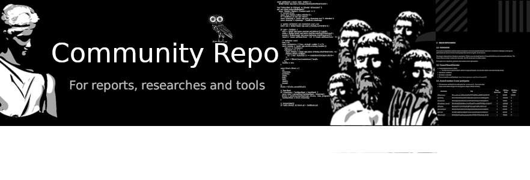

  <h4>
    <a href="/council">Council Reports</a> | <a href="/governance">Documentation</a> | <a href="/working-groups">WG Reports</a> | <a href="/bounties">Bounties</a> |  <a href="/contributions/research">Research</a> | <a href="scripts">Scripts</a>
  </h4>

Table of Contents
--

<!-- TOC START min:1 max:3 link:true asterisk:false update:true -->
- [Overview](#overview)
  - [Community Bounties](#community-bounties)
  - [Workflow](#workflow)
    - [KPI Related Submissions](#kpi-related-submissions)
    - [Individual Submissions](#individual-submissions)
    - [Jsgenesis Submissions](#jsgenesis-submissions)
    - [Revisions & Improvements of Submissions](#revisions--improvements-of-submissions)
<!-- TOC END -->

# Overview

The Joystream Community Repo is meant both as a resource for the community members of the Joystream project, and a place to submit their work or contributions.

If a KPI requires submitting a deliverable, eg. reports or some code, it is expected that a PR is made to this repo in order to qualify.

Although the community is meant to control the repo, Jsgenesis will approve and merge any pull requests for now. Note that the repo is licensed under [GPLv3](/LICENSE).

## Workflow

The workflow for changing the repo depends on the reason and purpose behind the change.
A consistent part is for the contributor to fork the repo, and create a pull request to the applicable branch.
All changes need to be approved with a proposal, except for selected [files](governance/Files_and_Folders_Naming_Rules.md).

### KPI Related Submissions
When a KPI requires a deliverable to be successful, the following steps must be made:
- A pull request is made to the master branch.
- A proposal is made to the [Joystream testnet](https://testnet.joystream.org/).
  - The proposal (`Text`, or in some cases, `Spending`) contains a link to the PR and other relevant information
  - When (if) the proposal is voted through, @bwhm and @blrhc is tagged
  - The time of the latest commit will be used as the time of submission
- The PR is reviewed, and as long as it does not contain anything malicious or does not comply with license, it is merged.
- The submission is added to the `Submission Log`

### Individual Submissions
If the deliverable is made by an individual, eg. for an existing or upcoming funding proposal, the following steps must be made:
- A pull request is made to the community branch, in a new folder within the `Community Contributions` directory.
  - Example: `Bot project - Author Name`
- A proposal is made to the [Joystream testnet](https://testnet.joystream.org/).
  - The proposal (`Text`, or in some cases, `Spending`) contains a link to the PR and other relevant information.
  - When (if) the proposal is voted through, @bwhm and @blrhc is tagged
- The PR is reviewed, and as long as it does not contain anything malicious or does not comply with the license of the repo, it is merged.
- The submission is added to the `Submission Log`

### Jsgenesis Submissions
If a member of the Jsgenesis team wants to make changes to the repo, the following steps must be taken:
- A pull request is made to the master branch
- A `Text` proposal is made to the [Joystream testnet](https://testnet.joystream.org/).
  - The proposal contains a link to the PR and other relevant information
  - When (if) the proposal is voted through, the PR is merged.
- The submission is added to the `Submission Log`

### Revisions & Improvements of Submissions
* For general updates (updating links, text) these can just be gathered occasionally and submitted as a rolling update like this example: https://testnet.joystream.org/#/proposals/14 This does mean that it will take some time for the PRs to be approved by the council.
* In the event of some highly important change, a proposal could be made so that the matter is addressed more quickly than waiting for a rolling update
* If users want to be paid for updates or corrections, then they should open a PR (or multiple PRs) and link to it in a spending proposal, when this is approved it would have the same effect as approving the PR (which still has to be reviewed by Jsgenesis)
* As an example, if a user wants to add functionality to the telegram bot and be paid for it, they can open a PR and create a spending proposal linking to the PR
