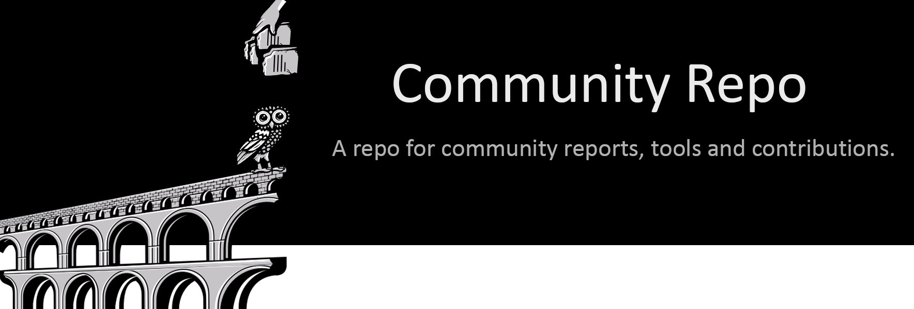

Table of Contents
--

<!-- TOC START min:1 max:3 link:true asterisk:false update:true -->
- [Overview](#overview)
  - [Testnet Archives](archives)
    - [Council](archives/council)
    - [Community Bounties](archives/bounties)
    - [FM History](archives/FM_history)
    - [Giza Backup](archives/giza_backup)
    - [Helpdesk](archives/helpdesk)
    - [Scripts](archives/scripts)
  - [Workflow](#workflow)
    - [Revisions & Improvements of Submissions](#revisions--improvements-of-submissions)
<!-- TOC END -->

# Overview

The Joystream Community Repo is a resource by the Joystream community with [archived testnet content](archives) by founding members.

Although the community controls the repo, Jsgenesis has final say to approve and merge pull requests with code. The content is licensed under [GPLv3](/LICENSE). Community members with merge permission are @mochet and @traumschule.

The workflow for changing the repo depends on the reason and purpose behind the change.
A consistent part is for the contributor to fork the repo, and create a pull request to the applicable branch.
All changes need to be approved with a proposal. For details see the [testnet workflow](archives).