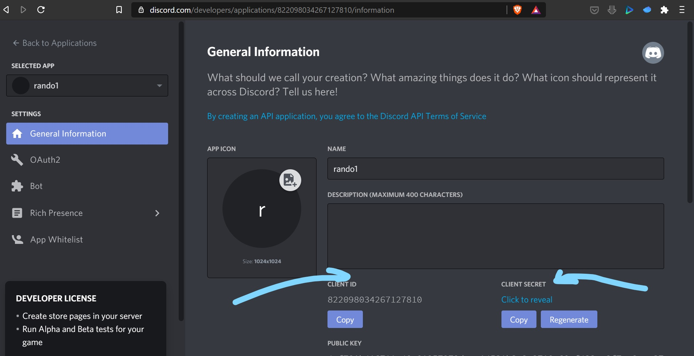

# How to Build a Discord Bot 

This document is written in response to the first question of request for [Joystream's](joystream.org) Bounty [13](https://github.com/Joystream/community-repo/issues/123)

## Getting Started

Go to Discord's [bot portal](https://discordapp.com/developers/applications/) and create a new application, giving it an appropriate name.


 Copy and save the Client ID and secret (where the 2 arrows are pointing at), making sure you keep the secret secret.


	

So far, what you have is a simple application.

You click on the Bot tab under settings to your left, and click on the "add a bot button". 


This would take you to your bot homepage. You'll be given a token, which you should take note off and keep safe. 

 

As an aside, never store any keys or tokens on GitHub, ESPECIALLY if the repo is public.


## Developing the Bot

While DIscord bots can be built with several different languages - the unofficial [Discord API  server](https://discord.gg/discord-api) has channels for at least 19 different languages -  I will concentrate on TypeScript.

The [Discord TypeScript Server](https://discord.gg/VDjwu8E) is an ideal source for interacting with other TypeScript developers. as well as a potential source for any technical help one may need. There's also an [examples folder](https://github.com/OwenCalvin/discord.ts/tree/master/examples) of bots built using the Discord TypeScript library.

### Installation
Use [`npm`](https://www.npmjs.com/package/@typeit/discord) or `yarn` to install `@typeit/discord` with `discord.js`:
```sh
npm i @typeit/discord discord.js
```

Your tsconfig.json should look like this:
```json
{
  "compilerOptions": {
    "module": "commonjs",
    "target": "es2017",
    "noImplicitAny": false,
    "sourceMap": true,
    "outDir": "build",
    "emitDecoratorMetadata": true,
    "experimentalDecorators": true,
    "importHelpers": true,
    "forceConsistentCasingInFileNames": true,
    "lib": [
      "es2017",
      "esnext.asynciterable"
    ],
    "moduleResolution": "node"
  },
  "exclude": [
    "node_modules"
  ]
}
```

### Setup and start your application
In order to start your application, you must use the `discord.`**`ts`**'s `Client` (not the client that is provided by `discord.`**`js`**!).  
It works the same as the `discord.`**`js`**'s `Client` (same methods, properties, ...).

You have different parameters in addition to discord.js when you initialize your `Client`:
- **`classes` (required)**:  
Indicate the class jacket of your classes containing the `@Discord` decorator. It accepts a list of classes or of (glob) paths.

- **`silent` (`false` by default)**:  
Allows you to disable your event information at startup.

- **`variablesChar` (`":"` by default)**:  
Allows you to change the prefix character of a variable. 


**You must specify the glob path(s) where your decorated classes are**

```typescript
// Use the Client that are provided by @typeit/discord NOT discord.js
import { Client } from "@typeit/discord";

async function start() {
  const client = new Client({
    classes: [
      `${__dirname}/*Discord.ts`, // glob string to load the classes
      `${__dirname}/*Discord.js` // If you compile using "tsc" the file extension change to .js
    ],
    silent: false,
    variablesChar: ":"
  });

  await client.login("YOUR_TOKEN");
}

start();
```


## Deploying the Bot
This is also for whomever takes step three of the bounty.