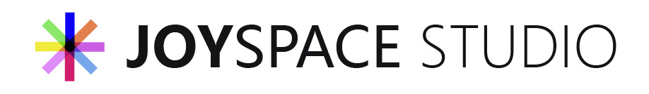

# Joyspace App Logo Contest

After the name for a new DAO-wide Gateway App was determined in the [first round](https://pioneerapp.xyz/#/proposals/preview/275) of this contest, the [second stage](https://pioneerapp.xyz/#/proposals/preview/308) asked the community for logo submissions.

> Hello! Suggest a logo for Joyspace - the Josytream DAO's Gateway for a chance to win 20,000 Joy. We accept only one entry for each participant. Submission of entry ends on May 20, 2023. Good luck!
> 
Vote for your favorite logo for the Joyspace Gateway App [here](https://discord.com/channels/811216481340751934/812340037198675978/1121809780185497750).

Logo reguirements are listed [here](https://github.com/Joystream/atlas/blob/master/docs/operator-guide.md#app-logo).

## 1

## 2

## 3

## 4

## 5

## 6

## 7

## 8

## 9

## 10

## 11

## 12

## 13

## 14

## 15

## 16

## 17

