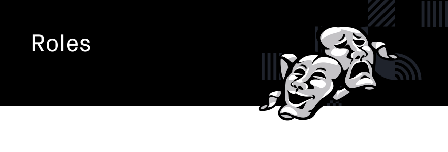

  <h4>If you want to stay updated on current and future roles on the Joystream platform,  
  visit the <a href="https://www.joystream.org/roles">roles section</a> on our website.<h4>

- [Overview](#overview)
- [Active Roles](#active-roles)
- [Future Roles](#future-roles)

# Overview
This page contains links to the guides for the currently active roles, and a list of the future platform roles.

# Active Roles
- [Validators](validators)
- [Council Members](council-members)
- [Storage Providers](storage-providers)
- [Content Creators](content-creators)
- [Content Curators](content-curators)
- [Builders and Bug Reporters](builders)

# Future Roles
 - Membership Screener
 - Membership Curator
 - Bandwidth Provider
 - Discovery Provider
 - Live Streaming Provider
 - Builder
 - Communication Moderator
