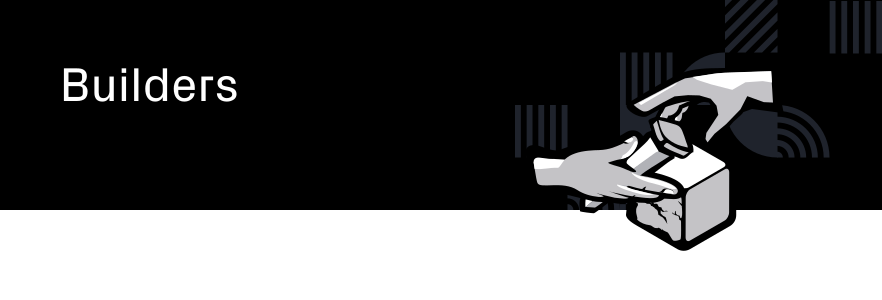

  <h4>This guide outlines the scope of work for the Operations working group
<h4>

Table of Contents
==
<!-- TOC START min:1 max:3 link:true asterisk:false update:true -->
- [Overview](#overview)
  - [Technical Infrastructure](#technical-infrastructure)
  - [Bounty Managers](#bounty-managers)
  - [Technical Support](#technical-support)
<!-- TOC END -->

# Overview
As the group is brand new, the scope of work is not yet settled. This document will therefore only briefly outline some of the anticipated tasks.

## Technical Infrastructure
A key part of the role is to maintain technical infrastructure, add new features, and create new tools.

An easy example is to maintan the `joystream-api` in the [Community Repo](https://github.com/Joystream/community-repo/), whenever new types are published, and add new tools and templates.

## Bounty Managers
Another key component of the role is to act as Bounty Managers for all things technical, and if they can't find someone else, take on the responsibility as BMs for all non-content bounties.

## Technical Support
Users will often run into technical obstacles where they need assistance. The Operations group should monitor both the forum, this repo, and especially our [Discord](https://discord.gg/DE9UN3YpRP).
