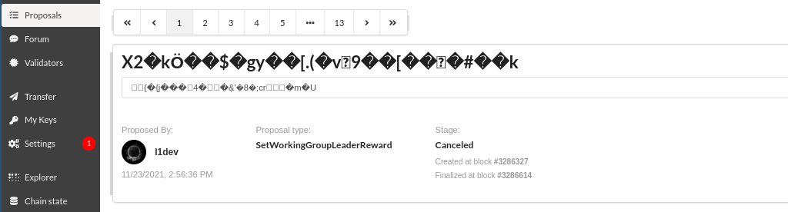
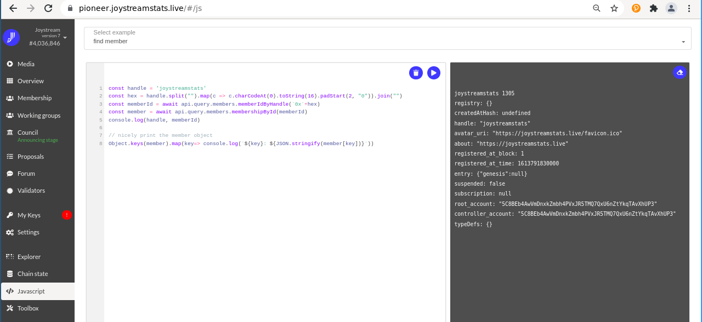

# Community Scripts



Here you find scripts and info how to retrieve and mutate data on joystream [blockchains](https://www.joystream.org/roles/).

There are several ways to access the chain storage. The easiest is the governance app [pioneer](/joystream/joystream/tree/master/pioneer).
- [How to use the `Chain State` in Pioneer](#chain-state)
- [How to use the `Javascript` page in Pioneer](#js)
- [joystream-cli](#joystream-cli)
- [joystream-lib](#joystream-lib)
- [api](#api)

Scripts
- [joystream-api](joystream-api) - examples for the joystream api
- [Council minutes script](report-generator) - generates Council reports in Markdown
- [sp-downloader-tester](sp-downloader-tester) - measure storage provider speed
- [node-setup-script](node-setup-script) - eases the installation of a [validator](https://github.com/Joystream/helpdesk/tree/master/roles/validators) node

Webapps
- [validator-report-ui](validator-report-u) - frontend to show eras for selected validator
- [validator-report-backend](validator-report-backend) - stores validator data for each era

Telgram & Discord Bots - [How to write a Discord bot](discordbot)]
- [joystream-leaderboard-bot](joystream-leaderboard-bot) - show FM stats + faucet
- [joystream-scoring-period-bot](joystream-scoring-period-bot) - sends scoring period deadlines to Telegram
- [joystreamtelegrambot](joystreamtelegrambot) - posts proposal updates and forum posts on Discord and Telegram
- [joystreamvideobot](joystreamvideobot) - posts video uploads to `#video` on Discord
- [storagesize-bot](storagesize-bot) - posts storage provider space usage to #storage-provider on Discord

## Contact

For usage questions: [#tech-support](https://discord.com/channels/811216481340751934/815192060276506664).
To join development come to [#operations](https://discord.com/channels/811216481340751934/812344874099277824) and check [Operations reports](../working-groups/operations-group).


## Chain State

First select `Fully Featured` for `interface operation mode` on [Settings](https://testnet.joystream.org/#/settings) and click `Save`.

Go to [Chain State](https://testnet.joystream.org/#/settings) and select `section` and `method`. Generally it is possible to disable the input field to retrieve a list of all entries (equivalent to for example `api.query.system.account.entries()` - see [double maps](https://polkadot.js.org/docs/api/cookbook/storage/#how-do-i-use-entrieskeys-on-double-maps)).

To see the balance of an account navigate to `system.account`, select or enter a key and press the `+` button.

When you find a member ID and want to know, who it is, use `members.membershipById`.

If the handle is known: `members.membershipById`. The result is the membership ID to retrieve the membership like above. It expects hexadecimal bytes prefixed with `0x` as input:
- Use a [hex converter](https://www.online-toolz.com/tools/text-hex-convertor.php) and prefix it with `0x`.
- With `node.js`: `Buffer.from("handle").toString('hex')`)
- On [JS](https://testnet.joystream.org/#/js) enter `console.log('handle'.split("").map(c => c.charCodeAt(0).toString(16).padStart(2, "0")).join(""))` (save as `string to hex` for later by clicking on the disk button)

With the member info two keys are included, `root_account` and `contoller_account`. These are usually equal, except someone changed the controller.
```
members.membershipById: Membership
{
  handle: joystreamstats,
  avatar_uri: https://joystreamstats.live/favicon.ico,
  about: https://joystreamstats.live,
  registered_at_block: 1,
  registered_at_time: 1,613,791,830,000,
  entry: {
    Genesis: null
  },
  suspended: false,
  subscription: null,
  root_account: 5C8BEb4AwVmDnxkZmbh4PVxJR5TMQ7QxU6nZtYkqTAvXhUP3,
  controller_account: 5C8BEb4AwVmDnxkZmbh4PVxJR5TMQ7QxU6nZtYkqTAvXhUP3
}
```
You can try this key with `system.account` to get the current balance.

With the key more lookups are possible:
- [https://api.joystreamstats.live/api/v1/accounts](https://api.joystreamstats.live/api/v1/accounts/5C8BEb4AwVmDnxkZmbh4PVxJR5TMQ7QxU6nZtYkqTAvXhUP3) - shows authored blocks for validators
- https://joystreamstats.live/transactions - recent token transfers

## JS

To use the `Javascript` page in Pioneer first select `Fully Featured` for `interface operation mode` on [Settings](https://testnet.joystream.org/#/settings) and click `Save`.

Open [Toolbox](https://testnet.joystream.org/#/js)), select one of the pre-defined code snippets and press the play button to execute it.

You can edit the code or paste your own script. If after editing the code nothing happens the browser console (`Ctrl + Shift + I`) can help to debug the problem.

For above example to get a membership enter:
```
const handle = 'joystreamstats'
const hex = handle.split("").map(c => c.charCodeAt(0).toString(16).padStart(2, "0")).join("")
const memberId = await api.query.members.memberIdByHandle(`0x` + hex)
const member = await api.query.members.membershipById(memberId)
console.log(handle, memberId)

// nicely print the member object
Object.keys(member).map(key=> console.log(`${key}: ${JSON.stringify(member[key])}`))
```
Result:
```
joystreamstats 1305
registry: {}
createdAtHash: undefined
handle: "joystreamstats"
avatar_uri: "https://joystreamstats.live/favicon.ico"
about: "https://joystreamstats.live"
registered_at_block: 1
registered_at_time: 1613791830000
entry: {"genesis":null}
suspended: false
subscription: null
root_account: "5C8BEb4AwVmDnxkZmbh4PVxJR5TMQ7QxU6nZtYkqTAvXhUP3"
controller_account: "5C8BEb4AwVmDnxkZmbh4PVxJR5TMQ7QxU6nZtYkqTAvXhUP3"
typeDefs: {}
```


Useful functions:
- `.hash()`: Displays the storage hash
- `.size()`: Display the storage entry size
- `.at()`: Display the historic value at a given block hash (see below)
- `.key`: Display the key for a double map
- `.keyPrefix`: Display the key prefix for a double map

Subscribe to balance changes for multiple accounts:
```
api.query.system.account.multi([ALICE, BOB], (info) => {
  console.log('Change detected, new balances: ', info)
});
```
(See example `Listen to multiple balances changes`)

Show events between two blocks:
```
const start = 2000200
const end = 2000500
const hide = [ 'ExtrinsicSuccess', 'HeartbeatReceived' ]

console.log(`--- Events between ${start} and ${end} ---`)
for (let block = start ; block <= end ; ++block) {
 const hash = await api.rpc.chain.getBlockHash(block)
 api.query.system.events.at(hash).then((events) => {
  // filter hidden event methods
  const filtered = events.filter(({event}) => !hide.includes(event.method))
  if (!filtered.length) return
  console.log(`#[${block}: ${events.length} event(s)`);
  // loop through the Vec<EventRecord>
  filtered.forEach((record) => {
  // extract the phase, event and the event types
    const { event, phase } = record;
    const types = event.typeDef;
    // show what we are busy with
    console.log(` - ${event.section}.${event.method}::${phase}=${phase.toString()}`);
    console.log(event.meta.documentation.toString().padStart(`\t`));
    // loop through each of the parameters, displaying the type and data
    event.data.forEach((data, index) => {
      console.log(types[index].type + ';' + data.toString());
    })
  })
 })
}
console.log(`---`)
```
See [augment-api-events.ts](https://github.com/Joystream/joystream/blob/master/types/augment/augment-api-events.ts) for a list of all extrinsics. Note that this runs much faster with a script connected to a local node.

- [script to show era payouts](https://github.com/joystream/community-repo/tree/kpi35op3/working-groups/operations-group/Network-deployment#code)


## joystream-cli

Another useful even tough at first time consuming tool to inspect working groups for example is the [cli](https://github.com/Joystream/joystream/tree/master/cli):
```
git clone https://github.com/Joystream/joystream
cd joystream/cli
yarn
yarn link || bash # Start a new shell after linking `cli`
./bin/run api:setUri # Select the default api endpoint
./bin/run working-groups:overview
./bin/run working-groups:openings
```
To select another group: `-g storageProviders, curators, operations[Alpha,Beta,Gamma]`


## api

All methods in `Chain State` are available using the `api`

To start try this compact example in [`joystream-api/src/general/status.ts`](joystream-api/src/general/status.ts) to query the chain:
```
git clone https://github.com/Joystream/community-repo
cd community-repo/scripts/joystream-api
community-repo/scripts/joystream-api$ yarn
yarn install v1.22.17
[1/4] Resolving packages...
success Already up-to-date.
$ yarn build
yarn run v1.22.17
$ tsc --build tsconfig.json
Done in 5.55s.
Done in 5.76s.
/community-repo/scripts/joystream-api$ yarn status
yarn run v1.22.17
$ node lib/general/status
Chain 'Joystream' - node: Joystream Node v5.9.0-c7711424ef-x86_64-linux-gnu
Runtime Version: 9.7.0
Council size: 20
Validator count: 69
Total Validator Locked Balances: 171694540
Done in 8.75s.
```
If you have no local validator node, change the provider URL in line 13, for example `wss://testnet-rpc-3-uk.joystream.org` or `wss://joystreamstats.live:9945` (alternatively click on the blue circle in Pioneer to see more, `custom endpoint` shows the address). Or set one up with [node-setup-script](node-setup-script) :)

The [folder](joystream-api) has more examples and it is worth to look around. You can also try queries from the scripts on the [JS page](https://pioneer.joystreamstats.live/#/js) directly and log the output:
```
  const [chain, nodeName, nodeVersion] = await Promise.all([
    api.rpc.system.chain(),
    api.rpc.system.name(),
    api.rpc.system.version()
  ]);

  console.log(`Chain '${chain}' - node: ${nodeName} v${nodeVersion}`);
```

For the current testnet [augment-api-query.ts](https://github.com/Joystream/joystream/blob/master/types/augment/augment-api-query.ts#L511) gives a list of all api queries with descriptions (also in `node_modules/@joystream/types/augment`):
```
/**
       * Registered unique handles and their mapping to their owner
       **/
      memberIdByHandle: AugmentedQuery<ApiType, (arg: Bytes | string | Uint8Array) => Observable<MemberId>, [Bytes]>;
      /**
       * Mapping of a controller account id to vector of member ids it controls
       **/
      memberIdsByControllerAccountId: AugmentedQuery<ApiType, (arg: AccountId | string | Uint8Array) => Observable<Vec<MemberId>>, [AccountId]>;
      /**
       * Mapping of a root account id to vector of member ids it controls.
       **/
      memberIdsByRootAccountId: AugmentedQuery<ApiType, (arg: AccountId | string | Uint8Array) => Observable<Vec<MemberId>>, [AccountId]>;
      /**
       * Mapping of member's id to their membership profile
       **/
      membershipById: AugmentedQuery<ApiType, (arg: MemberId | AnyNumber | Uint8Array) => Observable<Membership>, [MemberId]>;
```


## joystream-lib

The [joystream-lib](https://git.joystreamstats.live/Operations/joystream-lib) is a collection of functions used by for example the [report-generator](report-generator), [minting-burning-report](minting-burning-report) and [js:stats](https://git.joystreamstats.live/Operations/jsstats). It makes the code a little more readable and requires less work on type upgrades.

from [generator.ts](report-generator/src/generator.ts):
```
import { ApiPromise } from "@polkadot/api";
import { connectApi, getHead, getCouncils, getCouncilRound } from "./lib/api";
import { Round } from "./lib/types";

const providerUrl = "ws://127.0.0.1:9944"

async function printRounds () {
  const api: ApiPromise = await connectApi(providerUrl);
  await api.isReady;

  const head = await getHead(api);
  console.log(`current head: #${head}, round: ${await getCouncilRound(api)}`)
  getCouncils(api, +head).then(async (councils: Round[]) => {
    api.disconnect();
    councils.map(({ round, start, end }) => console.log(round, start, end))
    process.exit();
  });
}
printRounds()
```

Try to create this file in `report-generator/src/rounds.ts`, add `"rounds": "node build/rounds",` to the scripts in `packages.json` (after `storage`, note that in json the last element has no `,`) and run:
```
cd community-repo/scripts/report-generator
yarn && yarn build
yarn rounds
```
Result:
```
yarn run v1.22.17
$ node build/rounds
current head: #4041100, round: 42
2 118800 277199
4 277200 377999
5 378000 478799
6 478800 579599
7 579600 680399
...
```

To use it in your project just add it as [submodule](https://git-scm.com/book/en/v2/Git-Tools-Submodules) like [here](../.gitmodules) do
```
cd your-project
git submodule add https://git.joystreamstats.live/Operations/joystream-lib lib
git status # should show: 	new file:   .gitmodules
git commit -m "add joystream-lib submodule"
git push
```

When cloning:
```
git clone URL project
cd project
git submodule update --init --recursive
```
