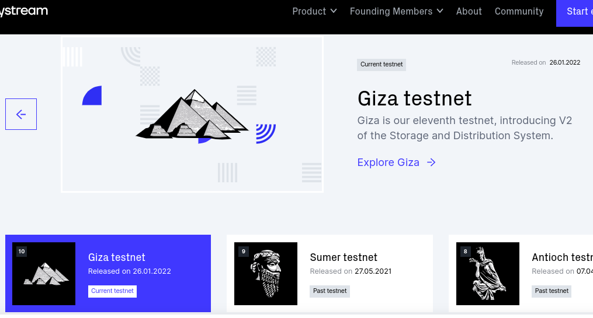
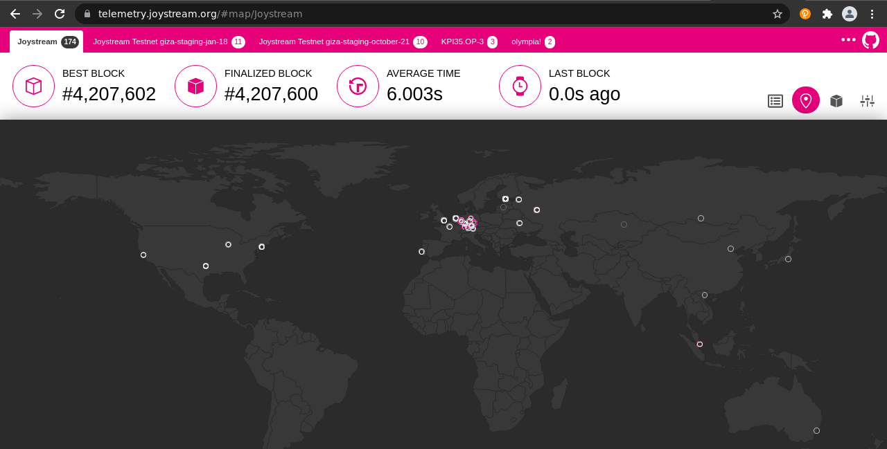
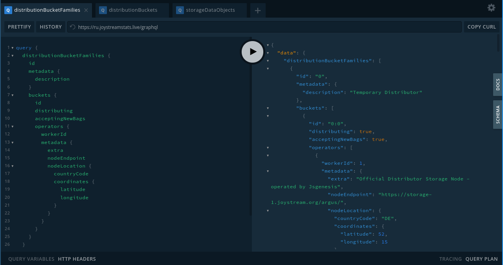
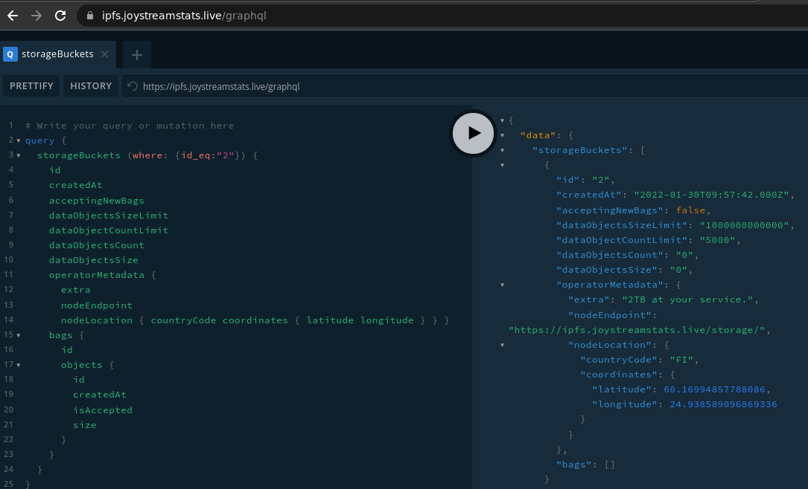
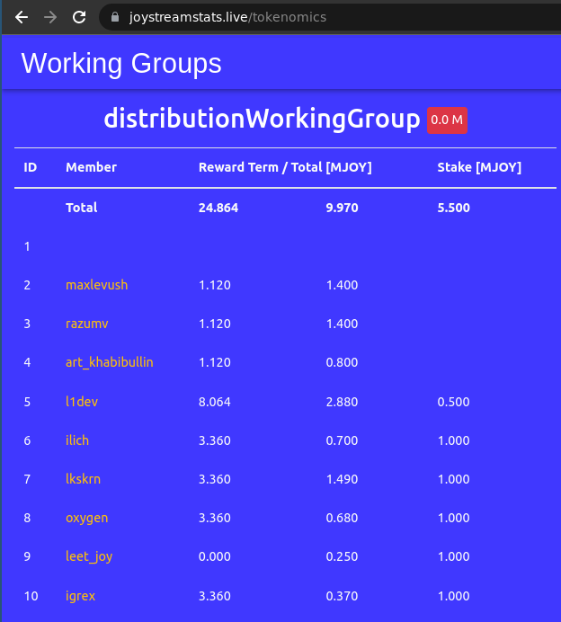
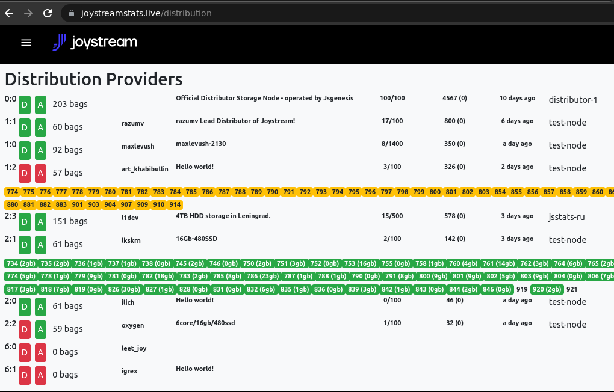

# Distribution Working Group

With [release of the Giza Testnet](https://blog.joystream.org/giza-released/) selected channels were [migrated from Sumer](https://github.com/traumschule/community-repo/tree/patch-2/working-groups/distributors/Sumer-Giza-migration) previous IPFS based storage system to complete in-house hosting with [storage nodes](https://github.com/Joystream/helpdesk/tree/master/roles/distributors) for bigger portions of assets and local [distribution nodes](https://github.com/Joystream/helpdesk/tree/master/roles/distributors) (read first).



Details about inception of the group are reported [here](https://pioneer.joystreamstats.live/#/forum/threads/928?replyIdx=12) (@freakstatic [assigned](https://pioneer.joystreamstats.live/#/forum/threads/917?replyIdx=14&page=2) this task to @l1dev who handed it @ilich).

- Lead: [@l1dev](https://pioneer.joystreamstats.live/#/proposals/1112) ([Concept](Distribution_Concept.md))
- Contact: [#distributors](https://discord.com/channels/811216481340751934/933726271832227911)


## Openings

- [Apply](https://pioneer.joystreamstats.live/#/working-groups/opportunities/distributionWorkingGroup): [Distributor in Central and South America](https://discord.com/channels/811216481340751934/933726271832227911/938557848294678598)

- Task: Develop tools to implement [Quality of Service](giza1.md#quality-of-service)

- Deputy role: Based on available buckets, which channels should be distributed where? Weekly update per bucket: `0-0: number[]`

- Create DP map: [discussion](https://discord.com/channels/811216481340751934/813361923172335648/939636962925641868)



Image source: https://telemetry.joystream.org/#/Joystream


## Reports

- [Giza 42](giza1.md)


## Tools

- GraphQL Playground comes with every [Query node](https://github.com/Joystream/joystream/tree/masyer/query-node): https://hydra.joystream.org/graphql (see [Queries](#queries) below)




- Workers: https://joystreamstats.live/tokenomics (look for `distributionWorkingGroup`)



- Test availability of bags on all nodes: https://joystreamstats.live/distribution




### Queries

Query nodes accept a specific [syntax](https://graphql.org/learn/queries/).

Each query takes optional `offset` and `limit` arguments (up to 10k depending on setup). When pasting a query he `PRETTIFY` button in graphql expands it.
`query { distributionBucketOperators (limit: 2, offset: 3) { workerId } }`

This returns workers 4 and 7 (see sorting below). Note that features like advanced filtering are not in scope and need to be implemented client side.

For more details start a [history lesson](https://github.com/Joystream/joystream/issues/358).
Do not miss to try below queries.

#### Sorting queries

````
orderBy: [DistributionBucketOperatorOrderByInput!]
enum DistributionBucketOperatorOrderByInput {
createdAt_ASC
createdAt_DESC
updatedAt_ASC
updatedAt_DESC
deletedAt_ASC
deletedAt_DESC
distributionBucket_ASC
distributionBucket_DESC
workerId_ASC
workerId_DESC
status_ASC
status_DESC
metadata_ASC
metadata_DESC
}
```

#### Distribution Families with endpoint operators
```
query { distributionBucketFamilies { id metadata{description} buckets {id distributing acceptingNewBags operators {workerId metadata{extra nodeEndpoint nodeLocation{countryCode,coordinates{latitude longitude}}}} } } }
```

#### Distribution Buckets with bags
```
query distributionBuckets { distributionBuckets { id createdAt distributing acceptingNewBags operators { id workerId metadata {nodeEndpoint} } bags { id } }}
```

#### Find asset locations

Filters need to be applied to the first (or second) level (query node doesn't support nested queries:
```
query { storageDataObjects(where: { id_eq: "9506" }) {
    id storageBag {
      distributionBuckets {
        id operators {
          metadata { nodeEndpoint } } } } } }
```

#### Storage Objects with license, bucket status and location
For curators to review new entries - the lead can assign each *offset* to a worker:
```
query getDataObjectsByVideoId { storageDataObjects(limit: 100, offset: 1) { id size deletionPrize storageBagId ipfsHash videomedia { id description licenseId license { code } media { storageBag { id owner { __typename } storageBuckets { id operatorMetadata { nodeLocation { countryCode } nodeEndpoint } createdById operatorStatus { __typename } dataObjectsSize acceptingNewBags dataObjectsCount dataObjectsSizeLimit } distributionBuckets { id bucketIndex familyId distributing createdById acceptingNewBags } } } } } }
```
