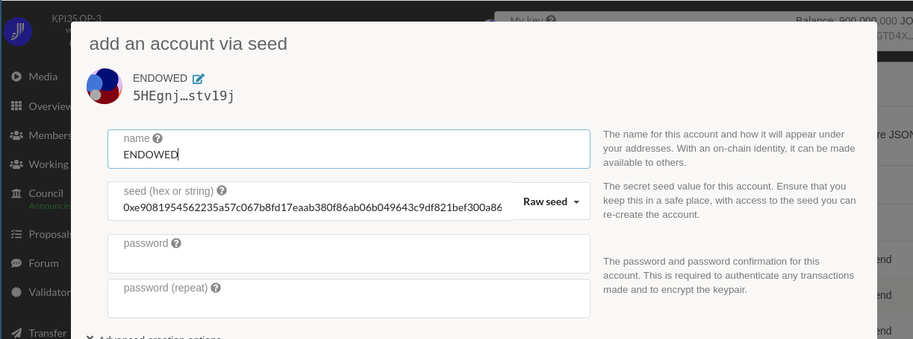
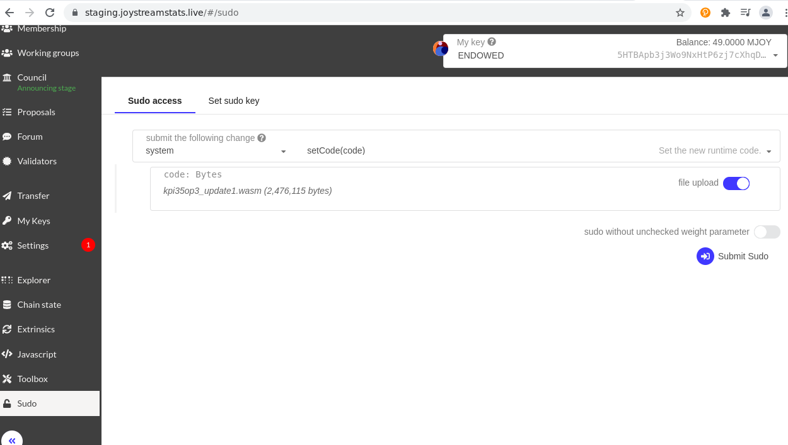

# [KPI 35.OP-3 - Runtime Upgrade Test](https://blog.joystream.org/sumer-kpis/#35.OP-3)

> Among other things, we want to adjust the Validator Staking Rewards through a runtime upgrade. We did this with the Constantinople runtime upgrade, so we know it was "safe" on previous versions of substrate. Let's confirm it works on this version as well, alongside some other changes.

The goal is to
- [Build joystream-node](#build-joystream-node)
- [Create chain spec](#chain-spec)
- [Deploy a test network](#deploy-network)
- [Perform a runtime upgrade](#runtime-upgrade)
- [Results](#results) table with blockheights, issuances, stakes, stakers, actions, rewards, eraIndex, etc.

Note: Target audience is technical with interest to run a substrate chain. Familiarity with terminals is recommended but all necessary info to reproduce the steps should be included, it helps to re-read
- [KPI 35.OP-3 - Runtime Upgrade Test](https://blog.joystream.org/sumer-kpis/#35.OP-3)
- [#507: Change the Staking Parameters With a Runtime Upgrade](https://github.com/Joystream/community-repo/issues/507)
- [Thread: Validator rewards](https://pioneer.joystreamstats.live/#/forum/threads/790)
- [Helpdesk: Validator setup](https://github.com/Joystream/helpdesk/tree/master/roles/validators)

## Build joystream-node

> 1. Build a runtime based on the Sumer branch. Make sure the nodes are configured so you can access, and use pioneer.

This means to allow remote connections with `--rpc-all`. Keeping that in mind for later.

Check out sumer branch of the joystream repository:
`$ git clone https://github.com/Joystream/joystream -b sumer`

See [node/README.md](https://github.com/Joystream/joystream/tree/sumer/node) and follow the instructions:
> Run ./setup.sh, build the infrastructure and the joystream-node.
```
$ cd joystream
setup.sh # install dependencies
WASM_BUILD_TOOLCHAIN=nightly-2021-03-24 cargo build --release # build runtime
````
If all goes well after some minutes we can use the newly built node. Unfortunately it fails:
```
     Compiling atty v0.2.14
     Compiling semver v0.9.0
  error[E0658]: use of unstable library feature 'btree_retain'
     --> /root/.cargo/registry/src/github.com-1ecc6299db9ec823/serde_json-1.0.73/src/map.rs:277:18
      |
  277 |         self.map.retain(f);
      |                  ^^^^^^
      |
      = note: see issue #79025 <https://github.com/rust-lang/rust/issues/79025> for more information
      = help: add `#![feature(btree_retain)]` to the crate attributes to enable

  error: aborting due to previous error
```

The giza branch uses a different rust version. From `setup.sh`:
```
rustup install nightly-2021-02-20
rustup target add wasm32-unknown-unknown --toolchain nightly-2021-02-20
```
and `node/README.md`:
`WASM_BUILD_TOOLCHAIN=nightly-2021-02-20 cargo +nightly-2021-02-20 build --release`

Using it works, just not on this instance:
```
WASM_BUILD_TOOLCHAIN=nightly-2021-02-20 cargo +nightly-2021-02-20 build --release
...
piler_builtins-ea377e9224b11a8a.rlib" "-Wl,-Bdynamic" "-lstdc++" "-lgcc_s" "-lutil" "-lrt" "-lpthread" "-lm" "-ldl" "-lc"
  = note: collect2: fatal error: ld terminated with signal 9 [Killed]
          compilation terminated.
```

For a successful build around 10GB free space and more than 2GB RAM are needed. This VPS has only 2GB and it was easier to build the binary on another one and use that:
```
$ joystream-node -V
joystream-node 5.9.0-decf3eff85-x86_64-linux-gnu
```

## Chain spec

### Build chain-spec-builder

It is not documented but to use the `chain-spec-builder` it needs to be built first:
```
cd utils/chain-spec-builder
WASM_BUILD_TOOLCHAIN=nightly-2021-02-20 cargo +nightly-2021-02-20 build --release
```

This creates `target/release/chain-spec-builder`:
```
~joystream$  target/release/chain-spec-builder
chain-spec-builder 3.1.1
A utility to easily create a testnet chain spec definition with a given set of authorities and endowed accounts and/or
generate random accounts

USAGE:
    chain-spec-builder <SUBCOMMAND>

FLAGS:
    -h, --help       Prints help information
    -V, --version    Prints version information

SUBCOMMANDS:
    generate    Create a new chain spec with the given number of authorities and endowed accounts. Random keys will
                be generated as required
    help        Prints this message or the help of the given subcommand(s)
    new         Create a new chain spec with the given authorities, endowed and sudo accounts```
```

Build with rust-nightly fails:
```
Compiling pallet-proposals-engine v3.2.0 (/home/joystream/joystream/runtime-modules/proposals/engine)
warning: field is never read: `finalized_at`
   --> runtime-modules/proposals/engine/src/types/mod.rs:352:5
    |
352 |     pub finalized_at: BlockNumber,
    |     ^^^^^^^^^^^^^^^^^^^^^^^^^^^^^
    |
    = note: `#[warn(dead_code)]` on by default

warning: `pallet-proposals-engine` (lib) generated 1 warning
   Compiling pallet-storage v4.0.0 (/home/joystream/joystream/runtime-modules/storage)
error[E0554]: `#![feature]` may not be used on the stable release channel
   --> runtime-modules/storage/src/lib.rs:120:12
    |
120 | #![feature(step_trait)]
    |            ^^^^^^^^^^

For more information about this error, try `rustc --explain E0554`.
error: could not compile `pallet-storage` due to previous error
```

### Generate chain spec

To run a test network each node needs a chain spec file (See: [#507](https://github.com/Joystream/community-repo/issues/507)).

Build chain spec: `./chain-spec-builder generate -a <a> -e <e> -i <i> -c /path/to/raw/chain_spec.json -k /path/to/validator/keys`

> <a> is the number of "authority" validators, that needs be started simultaniously when deploying the network.
> <e> is the number of "endowed" accounts, meaning keys with a starting balance of some amount of tokens. I suggest 1.
> <i> is the path to initial state, meaning you can pass a json with (exported) balances, content, forum and membership paths. Neither are strictly needed, but included for reference. I suggest skipping.

`-i` is not necessary. For `-a 2` and `-e 1` is good for testing, increase the number of authorities to go live. The directory specified with `-k` is being created. 

```
$ chain-spec-builder generate -a 2 -e 1 -k keys
Authority seeds
auth-0: //GXOJtYGrTbnbeO4uZxsb2mdihC95EdOj
auth-1: //r52IKKxCjdT5JLcAjyYsvv1dfDPyvM6P

Endowed seeds
endowed-0: //3mc7GpPkRnbklvWkDwnhOUdWl9yA0Zsr

Sudo seed
//TGkVNvt7hYjU5wfHZfuz3YxYrNdIdEXm

these are not actually in use..
```

`auth-0` goes to `<chain_dir>/keystore` on the first node, `auth-1` to the second.

To inspect the seeded keys [subkey](https://docs.substrate.io/v3/advanced/ss58/#subkey) needs to be installed:
```
$ cargo install --force subkey --git https://github.com/paritytech/substrate --version 2.0.1 --locked
$ subkey inspect //3mc7GpPkRnbklvWkDwnhOUdWl9yA0Zsr # endowed seed
Secret Key URI `//3mc7GpPkRnbklvWkDwnhOUdWl9yA0Zsr` is account:
  Secret seed:       0xe9081954562235a57c067b8fd17eaab380f86ab06b049643c9df821bef300a86
  Public key (hex):  0xe4ca06e861f511314e67a7b7c423a4d4071b83caa4cefdab4d762f837c8fc419
  Account ID:        0xe4ca06e861f511314e67a7b7c423a4d4071b83caa4cefdab4d762f837c8fc419
  Public key (SS58): 5HEgnjsWx8mpBtkMf4dngQB1FrhAWrqdJnh6P4pgUpstv19j
  SS58 Address:      5HEgnjsWx8mpBtkMf4dngQB1FrhAWrqdJnh6P4pgUpstv19j
```
Keep the secret seeds for later.

Generate descriptive chain spec:
```
$ joystream-node build-spec --chain chain_spec.json > kpi35op3_spec.json
Dec 19 12:00:24.645  INFO Building chain spec
```

Edited to:
```
{
  "name": "KPI35.OP-3",
  "id": "joy_kpi35op3",
  "chainType": "Live",
  "bootNodes": [
    "/ip4/127.0.0.1/tcp/30333/p2p/12D3KooWJAVBuLNVAiKsd1wUZS3hRcCT4VYuwUf9NudMg8h8ChWX"
  ],
  "telemetryEndpoints": [
    [
      "/dns/telemetry.joystream.org/tcp/443/x-parity-wss/%2Fsubmit%2F",
      0
    ]
  ],
  "protocolId": "/joy/kpi35op3",
  "properties": {
    "tokenDecimals": 0,
    "tokenSymbol": "JOY"
  },
```

Start the chain (note the typo in [#507](https://github.com/Joystream/community-repo/issues/507)):
```
joystream-node --chain kpi35op3_spec.json --validator --archive pruning
error: Found argument '--archive' which wasn't expected, or isn't valid in this context
        Did you mean --charlie?

USAGE:
    joystream-node --chain <CHAIN_SPEC> --charlie --validator

For more information try --help

$ joystream-node --chain kpi35op3_spec.json --validator --pruning archive
Dec 19 12:14:23.040  INFO Joystream Node
Dec 19 12:14:23.046  INFO ✌️  version 5.9.0-decf3eff85-x86_64-linux-gnu
Dec 19 12:14:23.047  INFO ❤️  by Joystream contributors, 2019-2021
Dec 19 12:14:23.047  INFO 📋 Chain specification: KPI35.OP-3
Dec 19 12:14:23.047  INFO 🏷  Node name: homeless-territory-8367
Dec 19 12:14:23.047  INFO 👤 Role: AUTHORITY
Dec 19 12:14:23.047  INFO 💾 Database: RocksDb at /home/joystream/.local/share/joystream-node/chains/joy_kpi35op3/db
Dec 19 12:14:23.048  INFO ⛓  Native runtime: joystream-node-11 (joystream-node-0.tx1.au9)
Dec 19 12:14:31.448  INFO 💸 new validator set of size 2 has been elected via ElectionCompute::OnChain for era 0
Dec 19 12:14:31.471  INFO 🔨 Initializing Genesis block/state (state: 0x0528…1f74, header-hash: 0xe9b7…e3b5)
Dec 19 12:14:31.482  INFO 👴 Loading GRANDPA authority set from genesis on what appears to be first startup.
Dec 19 12:14:31.934  INFO ⏱  Loaded block-time = 6000 milliseconds from genesis on first-launch
Dec 19 12:14:31.935  INFO 👶 Creating empty BABE epoch changes on what appears to be first startup.
Dec 19 12:14:31.935  INFO 🏷  Local node identity is: 12D3KooWHZwo5TwnTdKQzUBuS376yaLkPb36ihCHhzQHRQxmfjMy (legacy representation: 12D3KooWHZwo5TwnTdKQzUBuS376yaLkPb36ihCHhzQHRQxmfjMy)
Dec 19 12:14:31.943  INFO 📦 Highest known block at #0
Dec 19 12:14:31.946  INFO 〽️ Prometheus server started at 127.0.0.1:9615
Dec 19 12:14:31.951  INFO Listening for new connections on 127.0.0.1:9944.
Dec 19 12:14:31.954  INFO 👶 Starting BABE Authorship worker
Dec 19 12:14:36.954  INFO 💤 Idle (0 peers), best: #0 (0xe9b7…e3b5), finalized #0 (0xe9b7…e3b5), ⬇ 0.8kiB/s ⬆ 1.9kiB/s
```

Note the key and again update the chain spec:
```
"bootNodes": [
    "/ip4/51.83.128.34/tcp/30333/p2p/12D3KooWHZwo5TwnTdKQzUBuS376yaLkPb36ihCHhzQHRQxmfjMy"
],
```

Ready to proceed with deployment.


## Deploy network

The built `joystream-node`, the new chain spec and keys need to be transferred to the boot nodes:
- Either push from first node: `rsync -aP ~/KPI35OP3 second:`
- Or pull from second:
```bash
rsync first:KPI35OP3 ~
mkdir -p ~/chains/joy_kpi35op3
cd ~/KPI35OP3
cp -r keys/auth-1 ~/chains/joy_kpi35op3/keystore
./joystream-node --chain kpi35op3_spec.json --validator --pruning archive -d ~

Dec 19 13:26:58.555  INFO Joystream Node
Dec 19 13:26:58.557  INFO ✌️  version 5.9.0-decf3eff85-x86_64-linux-gnu
Dec 19 13:26:58.558  INFO ❤️  by Joystream contributors, 2019-2021
Dec 19 13:26:58.558  INFO 📋 Chain specification: KPI35.OP-3
Dec 19 13:26:58.558  INFO 🏷  Node name: zealous-stream-9293
Dec 19 13:26:58.559  INFO 👤 Role: AUTHORITY
Dec 19 13:26:58.559  INFO 💾 Database: RocksDb at /home/joystream/chains/joy_kpi35op3/db
Dec 19 13:26:58.559  INFO ⛓  Native runtime: joystream-node-11 (joystream-node-0.tx1.au9)
Dec 19 13:27:03.197  INFO 💸 new validator set of size 2 has been elected via ElectionCompute::OnChain for era 0
Dec 19 13:27:03.210  INFO 🔨 Initializing Genesis block/state (state: 0x802a…2766, header-hash: 0xba00…b5cb)
Dec 19 13:27:03.221  INFO 👴 Loading GRANDPA authority set from genesis on what appears to be first startup.
Dec 19 13:27:03.568  INFO ⏱  Loaded block-time = 6000 milliseconds from genesis on first-launch
Dec 19 13:27:03.569  INFO 👶 Creating empty BABE epoch changes on what appears to be first startup.
Dec 19 13:27:03.570  INFO 🏷  Local node identity is: 12D3KooWCoVWb7718udEu8bfrSjU5c51p9N8bex4G9sSsEY1R6qo (legacy representation: 12D3KooWCoVWb7718udEu8bfrSjU5c51p9N8bex4G9sSsEY1R6qo)
Dec 19 13:27:03.574  INFO 📦 Highest known block at #0
Dec 19 13:27:03.575  INFO 〽️ Prometheus server started at 127.0.0.1:9615
Dec 19 13:27:03.581  INFO Listening for new connections on 127.0.0.1:9944.
Dec 19 13:27:03.585  INFO 👶 Starting BABE Authorship worker
Dec 19 13:27:06.513  INFO 🔍 Discovered new external address for our node: /ip4/139.99.237.225/tcp/30333/p2p/12D3KooWCoVWb7718udEu8bfrSjU5c51p9N8bex4G9sSsEY1R6
Dec 19 13:27:08.585  INFO 💤 Idle (1 peers), best: #0 (0xba00…b5cb), finalized #0 (0xba00…b5cb), ⬇ 0.8kiB/s ⬆ 1.0kiB/s
Dec 19 13:27:13.585  INFO 💤 Idle (1 peers), best: #0 (0xba00…b5cb), finalized #0 (0xba00…b5cb), ⬇ 0.7kiB/s ⬆ 0.8kiB/s
Dec 19 13:27:13.734  INFO 👶 New epoch 0 launching at block 0x0e33…674c (block slot 273320072 >= start slot 273320072).
Dec 19 13:27:13.734  INFO 👶 Next epoch starts at slot 273320172
Dec 19 13:27:13.764  INFO ✨ Imported #1 (0x0e33…674c)
Dec 19 13:27:13.767  INFO [index: 1] Reporting im-online at block: 0 (session: 0): heartbeat(Heartbeat { block_number: 0, network_state: OpaqueNetworkState { peer_id: OpaquePeerId([152, 0, 36, 8, 1, 18, 32, 44, 89, 200, 33, 97, 238, 226, 49, 86, 187, 134, 200, 49, 147, 161, 44, 100, 41, 82, 11, 232, 161, 173, 98, 106, 188, 119, 197, 191, 210, 82, 34]), external_addresses: [OpaqueMultiaddr([116, 47, 105, 112, 52, 47, 49, 51, 57, 46, 57, 57, 46, 50, 51, 55, 46, 50, 50, 53, 47, 116, 99, 112, 47, 51, 48, 51, 51, 51])] }, session_index: 0, authority_index: 1, validators_len: 2 }, Signature(04d96b61804049352f3bbee3d294756ed5a032e599303abb0f113477245d0e4147ff7a4a9df858c488504aeb873f0cb4e6bc4363fe365bd40d41e2fd1904a982))
Dec 19 13:27:18.586  INFO 💤 Idle (1 peers), best: #1 (0x0e33…674c), finalized #0 (0xba00…b5cb), ⬇ 0.7kiB/s ⬆ 0.9kiB/s
Dec 19 13:27:19.313  INFO ✨ Imported #2 (0x7552…fcf8)
Dec 19 13:27:23.586  INFO 💤 Idle (1 peers), best: #2 (0x7552…fcf8), finalized #0 (0xba00…b5cb), ⬇ 0.7kiB/s ⬆ 0.8kiB/s
Dec 19 13:27:25.432  INFO ✨ Imported #3 (0x2d6d…0cfe)
Dec 19 13:27:28.586  INFO 💤 Idle (1 peers), best: #3 (0x2d6d…0cfe), finalized #1 (0x0e33…674c), ⬇ 0.9kiB/s ⬆ 0.8kiB/s
```

Both nodes should appear in [telemetry](https://telemetry.joystream.org/#list/KPI35.OP-3).

It is a good idea to run each as a [systemd service](https://github.com/Joystream/helpdesk/tree/master/roles/validators#run-as-a-service).

### Pioneer

At least one node has to be accessible (`--rpc-cors all`) via pioneer which requires generation of a TLS certificate for that instance: [pioneer.Dockerfile](https://github.com/Joystream/joystream/blob/giza/pioneer.Dockerfile) ([giza](https://github.com/Joystream/joystream/tree/giza/pioneer) branch): https://staging.joystreamstats.live (endpoint: `wss://staging.joystreamstats.live/endpoint`).

Add keys in pioneer using the secret seed in the `Raw seed` field. It has 100 M to get started.



### Staking

> 2. Add more stake to the validators/add more validators.

- Added a third validator and transferred 1 M from the endowed address (see *Generate chain spec* above):
https://staging.joystreamstats.live/#/explorer/query/1087
- Bonded 100K with it (`5DqWVKZBXdfRQjQprqM41imHiGTD4XXTA99uynHPm6Dqs5y3`): https://staging.joystreamstats.live/#/explorer/query/1103

> 3. Note down the EXACT stakes and issuance for a couple of eras, then change the values

To easily get all stakes for all eras, open https://staging.joystreamstats.live/#/js and enter:
```
api.query.staking.erasStakers.entries().then(
  stakers=>stakers.map(([key,stake])=> console.log(key.toHuman() ,stake))
)
```
The result will look like:
```
[1, 5FR1wbKDzPmU98G1qLbGagCyYsJjuGG9qcXDSGFzgwQqaC5x] {total: 5000, own: 5000, others: []}
[1, 5GRYbWSMBsYYhEPfXX3D63mWYJcCmLwtNhrRz3VPhtRMfByG] {total: 5000, own: 5000, others: []}
[2, 5FR1wbKDzPmU98G1qLbGagCyYsJjuGG9qcXDSGFzgwQqaC5x] {total: 5000, own: 5000, others: []}
[2, 5GRYbWSMBsYYhEPfXX3D63mWYJcCmLwtNhrRz3VPhtRMfByG] {total: 5000, own: 5000, others: []}
[0, 5FR1wbKDzPmU98G1qLbGagCyYsJjuGG9qcXDSGFzgwQqaC5x] {total: 5000, own: 5000, others: []}
[0, 5GRYbWSMBsYYhEPfXX3D63mWYJcCmLwtNhrRz3VPhtRMfByG] {total: 5000, own: 5000, others: []}
```

Or to compare total stake, issuance and rewards:
```
for (let era = +(await api.query.staking.currentEra()); era >= 0; --era) {
  const stake = await api.query.staking.erasTotalStake(era)
  const reward = await api.query.staking.erasValidatorReward(era)
  const issuance = await api.query.balances.totalIssuance()
  const percent = (100 * stake / issuance).toFixed(1)
  console.log(`era ${era} stake:${stake} issuance:${issuance} (${percent}%) reward:${reward}`)
}
```

> The key is to test with a stake ratio lower, higher and at the ideal one.

Raised the stake from 0% to 25% and 5M more a little later:
```
era 0 stake:10000 issuance:100010000 (0.0%) reward:572
era 1 stake:10000 issuance:100010000 (0.0%) reward:572
era 2 stake:10000 issuance:100010000 (0.0%) reward:572
era 3 stake:110000 issuance:100010000 (0.1%) reward:599
era 4 stake:25109999 issuance:100010000 (25.1%) reward:7242
era 5 stake:30110000 issuance:100010000 (30.1%) reward:8425
```

## Runtime Upgrade

> 4. Upgrade the runtime, and re-do 3.

The instructions do not make suggestions in what direction to change the parameters. As a guess JSG is interested to lower validator rewards. For this a reduction of the yearly inflation to 25% and of the ideal stake to 10% should work. Alternatively ideal stake could be set to 100% knowing that staking (validators) competes with council elections.

```
diff --git a/runtime/src/lib.rs b/runtime/src/lib.rs
index 24fb1eda3f..b3f6de52cd 100644
--- a/runtime/src/lib.rs
+++ b/runtime/src/lib.rs
@@ -340,8 +340,8 @@ impl pallet_session::historical::Trait for Runtime {
 pallet_staking_reward_curve::build! {
     const REWARD_CURVE: PiecewiseLinear<'static> = curve!(
         min_inflation: 0_050_000,
-        max_inflation: 0_750_000,
-        ideal_stake: 0_300_000,
+        max_inflation: 0_250_000,
+        ideal_stake: 0_100_000,
         falloff: 0_050_000,
         max_piece_count: 100,
         test_precision: 0_005_000,
```

Every upgrade needs to [bump the version](https://github.com/Joystream/joystream/issues/1) in `runtime/src/lib.rs`:
```
diff --git a/runtime/src/lib.rs b/runtime/src/lib.rs
index 24fb1eda3f..1bf3a16e6d 100644
--- a/runtime/src/lib.rs
+++ b/runtime/src/lib.rs
@@ -83,7 +83,7 @@ pub const VERSION: RuntimeVersion = RuntimeVersion {
     spec_name: create_runtime_str!("joystream-node"),
     impl_name: create_runtime_str!("joystream-node"),
     authoring_version: 9,
-    spec_version: 11,
+    spec_version: 12,
     impl_version: 0,
```

Compiling the WASM is fast because the node was just being built:
```
$ WASM_BUILD_TOOLCHAIN=nightly-2021-02-20 cargo +nightly-2021-02-20 build --release
   Compiling joystream-node-runtime v9.11.0 (/home/joystream/joystream/runtime)
   Compiling joystream-node v5.9.0 (/home/joystream/joystream/node)
   Compiling chain-spec-builder v3.1.1 (/home/joystream/joystream/utils/chain-spec-builder)
    Finished release [optimized] target(s) in 2m 18s
```

According to [runtime/README.md](https://github.com/Joystream/joystream/tree/master/runtime) the new system code will be at
- `target/release/wbuild/joystream-node-runtime/joystream_node_runtime.compact.wasm`:
```
b2sum -l256 target/release/wbuild/joystream-node-runtime/joystream_node_runtime.compact.wasm
735e8c496122db936697b1f166f39dc28698378cbefa7e192125d638dfe6ec95 target/release/wbuild/joystream-node-runtime/joystream_node_runtime.compact.wasm
```

The [compact WASM file](https://joystreamstats.live/static/kpi35op3_update1.wasm) (2.4mb) needs to be uploaded at https://staging.joystreamstats.live/#/sudo using `system.setCode`.

(enable `sudo without unchecked weight parameter` to avoid the error `Invalid transaction validity: InvalidTransaction::ExhaustsResources` / `Invalid Transaction: Transaction would exhaust the block limits`)



```
signAndSend: status :: {"events":[],"status":{"broadcast":["12D3KooWCoVWb7718udEu8bfrSjU5c51p9N8bex4G9sSsEY1R6qo","12D3KooWT1pJHuSx5nkvpwpnYJ3XTosrzRCAZSJthZUDdMFXfP74"]}}
2021-12-21 11:26:10        API/INIT: Runtime version updated to spec=12, tx=1
signAndSend: status :: {"dispatchInfo":{"weight":200000000,"class":"Operational","paysFee":"Yes"},"events":[{"phase":{"applyExtrinsic":2},"event":{"index":"0x0002","data":[]},"topics":[]},{"phase":{"applyExtrinsic":2},"event":{"index":"0x1000","data":[{"ok":[]}]},"topics":[]},{"phase":{"applyExtrinsic":2},"event":{"index":"0x0000","data":[{"weight":200000000,"class":"Operational","paysFee":"Yes"}]},"topics":[]}],"status":{"finalized":"0x9d6d03656d80fe1b4c7e7791eac93042ac4decf52133ccd8688b3600760a1d43"}}
```

With the successful upgrade the ideal stake was at 10% and the reward dropped as expected:
```
era 44 stake:30110000 issuance:100010000 (30.1%) reward:8425
era 45 stake:30110000 issuance:100010000 (30.1%) reward:710
era 46 stake:30110000 issuance:100010000 (30.1%) reward:710
era 47 stake:30110000 issuance:100010000 (30.1%) reward:710
era 48 stake:5110000 issuance:100010000 (5.1%) reward:1733
```

By reducing total stake by 25M the reward recovered from 710 (25%) to 1733 (60%). Note that the maximum era payout changed from 8500 to 2847 (33%) because the inflation was cut to 1/3.

After [reporting to JSG](https://discord.com/channels/811216481340751934/922174266215116860/922822456929038389) the [change](https://github.com/Joystream/joystream/pull/2955) was added to [added to giza-staging](https://github.com/Joystream/joystream/pull/2957):
```
-         max_inflation: 0_750_000,
-         ideal_stake: 0_300_000,
+        max_inflation: 0_150_000,
+        ideal_stake: 0_250_000,
```

This will reduce individual validator rewards for `giza` to 1/5 ($8/m) with weekly platform costs around 6M ($150).


## Make changes

[Join the test!](https://discord.com/channels/811216481340751934/813361923172335648/922174266215116860)

> 5. Let the chain for a couple of days, and try to:
- make changes to the validator set
- add a couple more validators, then turn off two, and have them kicked out for a couple eras before restarting them
- make some random transactions (balance, forum, content, etc.)

To run a validator, use this [chain spec](https://joystreamstats.live/static/kpi35op3_spec.json).

**Quickstart:**
```
wget https://joystreamstats.live/static/joystream-node
wget https://joystreamstats.live/static/kpi35op3_spec.json
chmod +x joystream-node
./joystream-node --chain kpi35op3_spec.json --validator --pruning archive --log runtime,txpool,transaction-pool,trace=sync
```

## Results

> 6. All results, in table format with blockheights, issuances, stakes, stakers, actions, rewards, eraIndex, etc.

| Block | Era | Issuance | Stake | % Staked | Era Reward | Action |
|---|---|---|---|---|---|---|
| 0 | 0 | 100010000 | 10000 | 0.0 | 572 | |
| 600 | 1 | 100010000 | 10000 | 0.0 | 572 | |
| 1200 | 2 | 100010000 | 10000 | 0.0 | 572 | |
| 1800 | 3 | 100010000 | 110000 | 0.1 | 599 | [Used the ENDOWED key to stake 25M and nominate all three validators](https://staging.joystreamstats.live/#/explorer/query/1999) |
| 2400 | 4 | 100010000 | 25109999 | 25.1 | 7242 | [Bonded 5M more (now 30M of 100M = 30%)](https://staging.joystreamstats.live/#/explorer/query/2447) |
| 3000 | 5 | 100010000 | 30110000 | 30.1 | 8425 | |
| 26400 | 44 | 100010000 | 30110000 | 30.1 | 8425 | |
| 27000 | 45 | 100010000 | 30110000 | 30.1 | 710 | [setCode](https://staging.joystreamstats.live/#/explorer/query/27566) |
| 27600 | 46 | 100010000 | 30110000 | 30.1 | 710 | |
| 28200 | 47 | 100010000 | 30110000 | 30.1 | 710 | Stopped nominating (25M) |
| 28800 | 48 | 100010000 | 5110000 | 5.1 | 1733 | |
| 30000 | 50 | 100010000 | 5110000 | 5.1 | 1733 | [Bonded 1M](https://staging.joystreamstats.live/#/explorer/query/30496) |
| 30600 | 51 | 100010000 | 5110000 | 5.1 | 1733 | [Bonded 1M](https://staging.joystreamstats.live/#/explorer/query/30710) |
| 31200 | 52 | 100010000 | 5110000 | 7.1 | 2189 | [Bonded 1M](https://staging.joystreamstats.live/#/explorer/query/31204) |
| 31800 | 53 | 100010000 | 8110000 | 8.1 | 2417 | [Bonded 1M](https://staging.joystreamstats.live/#/explorer/query/32085) |
| 32400 | 54 | 100010000 | 9110000 | 9.1 | 2644 | |
| 33600 | 56 | 100010000 | 9110000 | 9.1 | 2644 | [Bonded 1M](https://staging.joystreamstats.live/#/explorer/query/33821) |
| 34200 | 57 | 100010000 | 9960000 | 10.0 | 2838 | [Bonded 40K](https://staging.joystreamstats.live/#/explorer/query/34385)<br/>[Bonded 100K](https://staging.joystreamstats.live/#/explorer/query/35183) |
| 35200 | 58 | 100010000 | 10000000 | 10.0 | 2847 | |
| 37600 | 62 | 100010000 | 10100000 | 10.1 | 2817 | |
| 38200 | 63 | 100010000 | 10100000 | 10.1 | 2817 | [Bonded 100K](https://staging.joystreamstats.live/#/explorer/query/38477) |
| 38800 | 64 | 100010000 | 10100000 | 10.1 | 2817 | [Bonded 100K](https://staging.joystreamstats.live/#/explorer/query/39045) |
| 39200 | 65 | 100010000 | 10200000 | 10.2 | 2786 | |
| 39800 | 66 | 100010000 | 10300000 | 10.3 | 2756 | |
| 41600 | 69 | 100010000 | 10300000 | 10.3 | 2756 | [Bonded 100K](https://staging.joystreamstats.live/#/explorer/query/41886) |
| 42200 | 70 | 100010000 | 10300000 | 10.3 | 2756 | |
| 42800 | 71 | 100010000 | 10400000 | 10.4 | 2725 | [Bonded 100K](https://staging.joystreamstats.live/#/explorer/query/42880) |
| 43400 | 72 | 100010000 | 10500000 | 10.5 | 2696 | |
| 61400 | 102 | 100010000 | 10500000 | 10.5 | 2696 | Transferred 2M to 2 new validators ([1](https://staging.joystreamstats.live/#/explorer/query/61861) and [2](https://staging.joystreamstats.live/#/explorer/query/61885)) and bonded: [1](https://staging.joystreamstats.live/#/explorer/query/61877) and [2](https://staging.joystreamstats.live/#/explorer/query/61892) |
| 62000 | 103 | 100010000 | 10500000 | 10.5 | 2696 | |
| 62600 | 104 | 100010000 | 12499998 | 12.5 | 2178 | |
| 63200 | 105 | 100010000 | 11499999 | 11.5 | 2421 | |
| 71000 | 118 | 100010000 | 11499999 | 11.5 | 2421 | Turned off 2 nodes, 1 validator slashed: [Offline](https://staging.joystreamstats.live/#/explorer/query/71121) and [SomeOffline](https://staging.joystreamstats.live/#/explorer/query/71204) |
| 71600 | 119 | 100010000 | 10500000 | 10.5 | 2696 | |

(Periods without changes left out.)

### Code

Script to generate the table:
```
const head = await api.derive.chain.bestNumber()
for (let block = 0 ; block < head ; block += 600) {
  const hash = await api.rpc.chain.getBlockHash(block)
  const era = +(await api.query.staking.currentEra.at(hash))
  const issuance = await api.query.balances.totalIssuance.at(hash)
  const stake = await api.query.staking.erasTotalStake(era)
  const reward = await api.query.staking.erasValidatorReward(era)
  const percent = (100 * stake / issuance).toFixed(1)
  console.log(`| ${block} | ${era} | ${issuance} | ${stake} | ${percent} | ${reward} | |`)
}
```

### Hours

| Date         | Hours | Task                                          | Who       |
|---|---|---|---|
| Dec 17 14-15 |     1 | Configure SSH                                 | zazik, l1 |
| Dec 17 21-22 |     1 | Build and run node                            | zazik, l1 |
| Dec 19 9-11  |     2 | Build chain-spec builder, generate chain spec | l1        |
| Dec 19 12-14 |     2 | Deploy network                                | l1        |
| Dec 19 14-15 |     1 | Setup Pioneer, import keys                    | l1        |
| Dec 19 15-17 |     1 | Add stake, script to log era stats, publish   | l1        |
| Dec 19 17-21 |     4 | Documentation                                 | l1        |
| Dec 20 18-19 |     1 | Runtime Upgrade, fail                         | l1        |
| Dec 21 12-13 |     1 | Runtime Upgrade, success                      | l1        |
| Dec 21 15-20 |     2 | Change stakes, update documentation           | l1        |
|              |    16 |                                               |           |